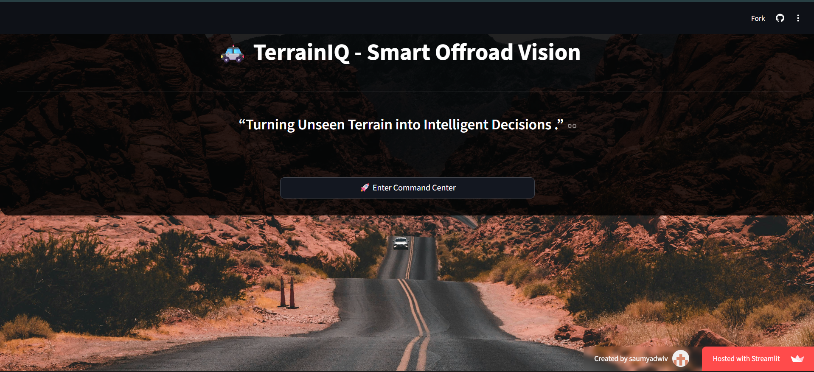
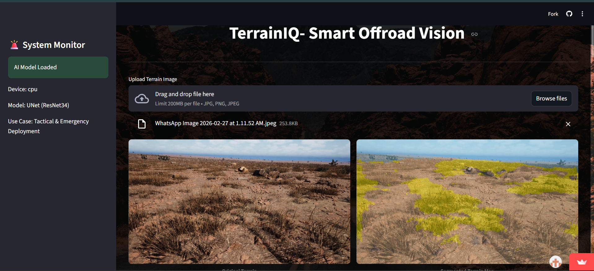
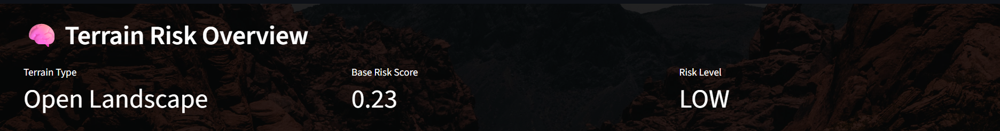
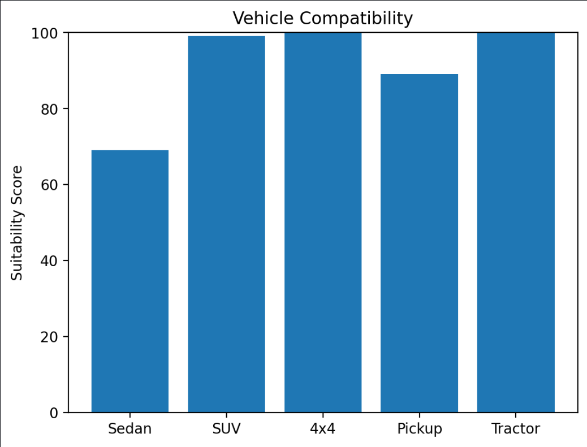
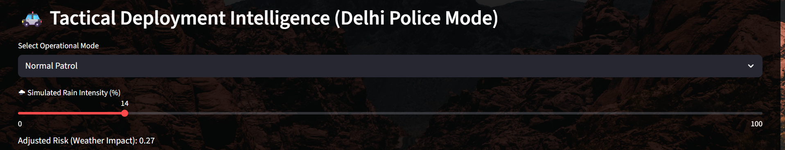
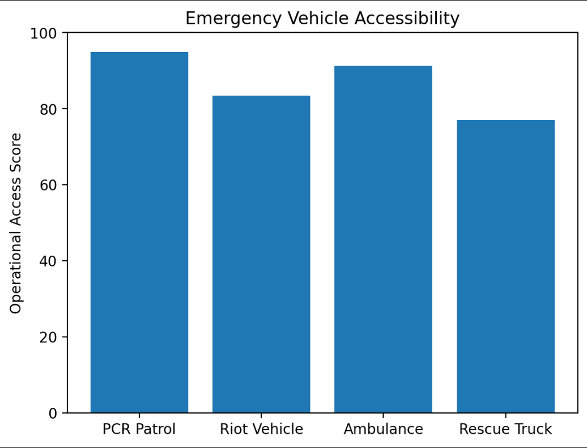
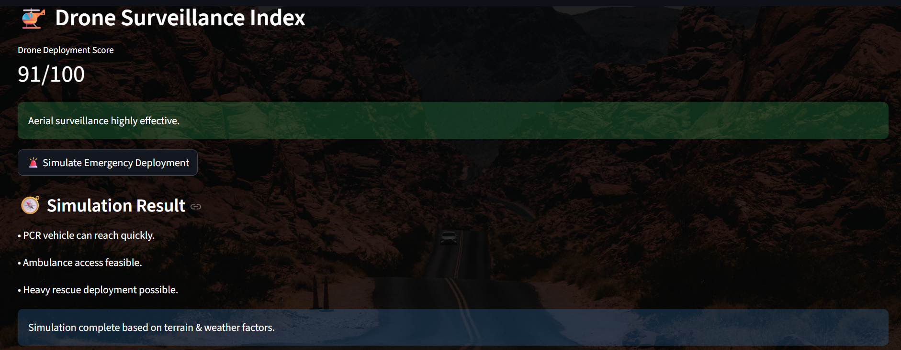
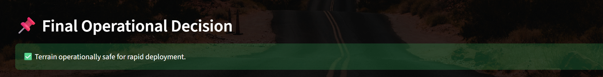

#  TerrainIQ – AI Terrain Intelligence System

> Turning Unseen Terrain into Intelligent Decisions

---

##  Overview

**TerrainIQ** is an AI-powered terrain segmentation and tactical risk analysis system built for:

-   Law Enforcement  
-   Emergency Response  
-   Disaster Rescue  
-   Off-road Mobility  

It uses a **UNet (ResNet34)** deep learning model to convert terrain images into actionable mobility intelligence.

---

##  Application Preview










---

##  Core Features

-   **Pixel-Level Terrain Segmentation (10 Classes)**
-   **Intelligent Risk Scoring Engine**
-   **Vehicle Suitability Analysis**
-   **Drone Surveillance Index**
-   **Emergency Deployment Simulation**
-   **Tactical Deployment Intelligence (Delhi Police Mode)**
  
---

##  Tech Stack

###  Programming & Frameworks
- **Python**
- **Streamlit** (Interactive Web Dashboard)
- **Jupyter Notebook** (Model Development & Experimentation)

###  Deep Learning & Computer Vision
- **PyTorch**
- **Torchvision**
- **U-Net (Encoder–Decoder Architecture)**
- **ResNet34 Encoder**
- **segmentation-models-pytorch**

### Data Processing & Visualization
- **NumPy**
- **OpenCV**
- **Matplotlib**

###  Evaluation & Metrics
- **Intersection over Union (IoU)**
- Pixel-wise Semantic Segmentation Accuracy

## 📊 Model Performance

### 🔹 Validation Performance (In-Distribution)

- **Validation IoU:** `0.3900`

The model achieves stable multi-class terrain segmentation accuracy on validation data drawn from the same distribution as the training set. This demonstrates effective feature learning and convergence of the U-Net (ResNet34) architecture.

---

### 🔹 Cross-Environment Performance (Out-of-Distribution)

- **Cross-Environment IoU:** `0.2390`

When evaluated on unseen terrain environments, performance decreases due to domain shift between training and test data. This reflects real-world deployment challenges where terrain textures, lighting conditions, and environmental distributions differ.

---

### 📈 Performance Analysis

- The gap between validation and cross-environment IoU highlights the following:
  - Terrain appearance variability  
  - Lighting and environmental shifts  
  - Class imbalance in rare terrain categories  

- Despite distribution shift, the model maintains meaningful segmentation capability, enabling reliable downstream decision-making in:
  - Risk Scoring  
  - Vehicle Suitability Analysis  
  - Tactical Deployment Simulation  

---

### 🧠 Generalization Insight

> The observed generalization gap demonstrates strong in-distribution learning while identifying opportunities for future enhancement through domain adaptation techniques, stronger augmentation pipelines, and multi-environment training strategies.
###  Dataset
- **Synthetic Digital Twin Dataset**
- Generated using **Duality AI Falcon**
---

##  Installation & Setup

```bash
git clone https://github.com/your-username/TerrainIQ.git
cd TerrainIQ
pip install -r requirements.txt
streamlit run app.py
```

---

##  How It Works

1. Upload terrain image  
2. AI performs segmentation  
3. Risk engine calculates terrain score  
4. Tactical module simulates deployment  
5. System outputs final operational decision  

---

##  Future Scope

- Real-time video segmentation  
- Edge AI deployment (Jetson Nano)  
- Path planning integration  
- Multi-sensor fusion  

---
---

## 🚀 Live Demo (hosted on streamlit)

 **Deployed Application:**  
  https://terrainiq-e4jrqkq6cjbx2qq7au4xkw.streamlit.app/

---

##  Team Members

- **Sakshi Mittal** – AI & Systems Developer  
- **Saumya Dwivedi** – AI & Systems Developer 

---

> AI doesn’t just detect terrain.  
> It enables safe autonomy beyond roads.
